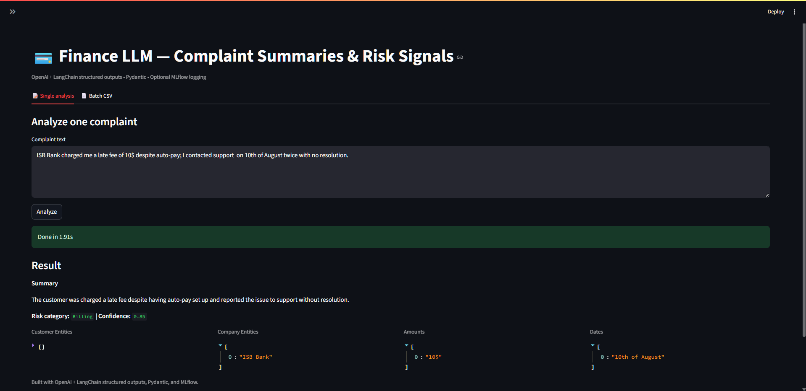
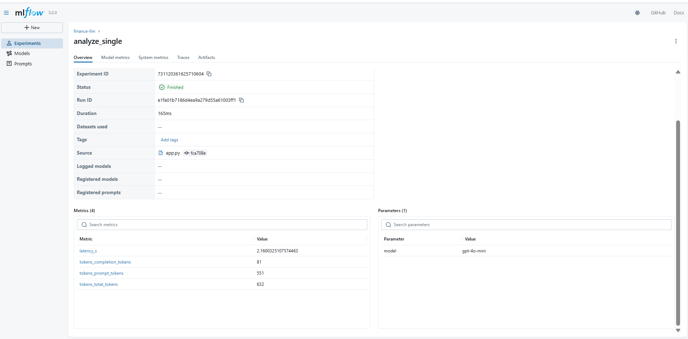

Finance LLM — Complaint Summaries & Risk Signals

OpenAI + LangChain structured outputs • Pydantic • (optional) MLflow logging • Streamlit UI

🚀 What this project does

    Ingests public consumer-finance complaints (e.g., CFPB CSV).

    Uses an LLM to:

    Summarize each complaint (2–3 sentences),

    Classify into one risk category: Billing, Collections, DataPrivacy, Fees, MisSelling, Fraud, Other,

    Extract typed fields (entities, dates, amounts).

    Serves a Streamlit app for single and batch analysis.

    Tracks latency (and optionally tokens) with MLflow.

📂 Project structure
    finance-ll-complaints/
    ├─ app/
    │  └─ app.py                     # Streamlit UI (OpenAI-only)
    ├─ src/
    │  ├─ ingest.py                  # load/clean raw CFPB CSV → processed CSV
    │  ├─ schema.py                  # Pydantic models with validators & normalization
    │  ├─ chains.py                  # LangChain pipelines + CLI (single/batch)
    │  ├─ evaluate.py                # weak-label evaluation vs Issue/Product
    │  └─ utils.py                   # (optional helpers)
    ├─ data/
    │  ├─ raw/                       # raw input CSVs (gitignored)
    │  └─ processed/                 # cleaned/scored CSVs (gitignored)
    ├─ assets/
    │  └─ banner.png                 # (optional) project banner
    ├─ .env.example                  # template for API keys
    ├─ .gitignore
    ├─ requirements.txt              # unpinned deps (latest)
    └─ README.md    
🧰 Requirements

    Python 3.10+ (3.11 recommended)

    An OpenAI API key with access to a GPT-4o family model (default: gpt-4o-mini)

🔐 Environment variables

Create a local .env (copy from the example and fill your key):

    OPENAI_API_KEY=sk-...your key...
    OPENAI_MODEL=gpt-4o-mini
    # Optional MLflow remote (leave blank to use local UI):
    MLFLOW_TRACKING_URI=

📦 Data

    Use the [CFPB Consumer Complaint Database export (CSV)](https://www.consumerfinance.gov/data-research/consumer-complaints/) Save a file like complaints.csv to:

        data/raw/complaints.csv

    Then clean/sample it:
         python src/ingest.py

▶️ Run the Streamlit app (OpenAI-only)
    
    streamlit run app/app.py

    In the app:

    Single analysis: paste one complaint → get summary, category, confidence, and extracted fields.

    Batch CSV: upload a CSV, choose the text column, pick a row limit, run analysis, preview + download the scored CSV.

    MLflow logging: toggle in the sidebar (logs latency; tokens when available).

🧪 CLI usage (LangChain pipelines)

    You can also run the pipeline from the terminal via chains.py:

    # Single text
    python src/chains.py single -t "Unauthorized charge on my card; bank refused to reverse the fee."

    # Batch (limit rows to keep cost/time in check)
    python src/chains.py batch -i data/processed/complaints_clean.csv -o data/processed/complaints_scored

📊 Evaluation (weak labels)

    Evaluate LLM categories against a keyword-mapped label derived from CFPB Issue + Product:
   
        python src/evaluate.py

📈 MLflow (local)
    
    Track latency (and optional tokens) for LLM calls:

        mlflow ui
    Open the URL it prints (usually http://127.0.0.1:5000) and look for experiment finance-llm.
    To log to a remote server later, set MLFLOW_TRACKING_URI in .env.

🧠 Model & prompting notes

    Structured outputs: The app uses langchain structured output to coerce LLM responses into a strict Pydantic schema.

    Normalization: schema.py normalizes risk_category to one of
    Billing | Collections | DataPrivacy | Fees | MisSelling | Fraud | Other.
    It also coerces risk_confidence to a float in [0,1] (accepts "90%", "0.9", or 0.9).

    Anchoring: The prompt applies precedence rules to reduce drift (e.g., prioritize credit-reporting signals → DataPrivacy).

🖼️ Screenshots
    **Streamlit — Single analysis**  
    

    **MLflow — Runs**  
    

🗺️ Roadmap

    Add a small few-shot bank of labeled examples to further stabilize categories.

    Add cost & token dashboards in the UI.

    Swap in vector retrieval for entity normalization (companies, products).

    Deploy the Streamlit app to Streamlit Community Cloud or Azure App Service.

    (Optional) Expose a FastAPI endpoint for integration.

🔒 License
This project is licensed under the MIT License — see the [LICENSE](LICENSE) file for details.